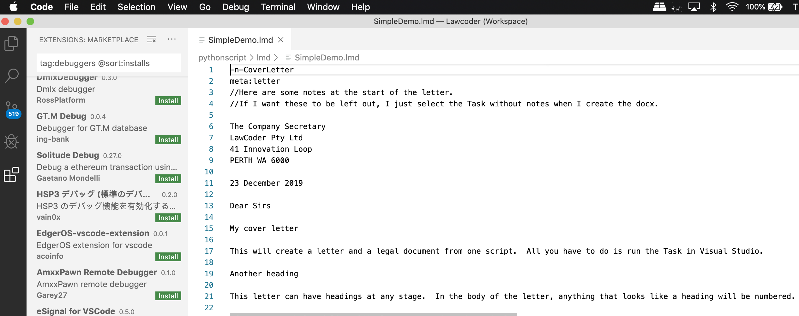
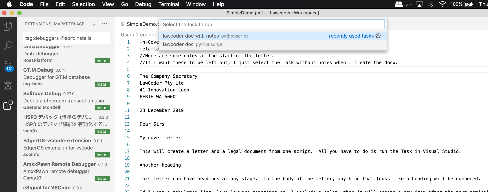
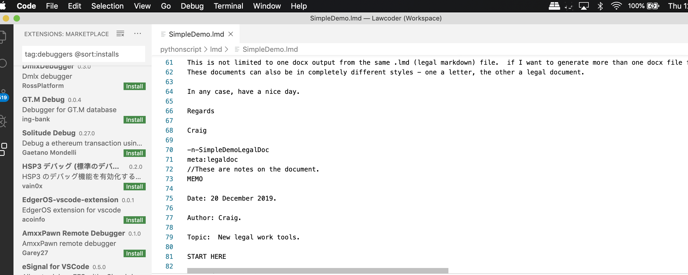
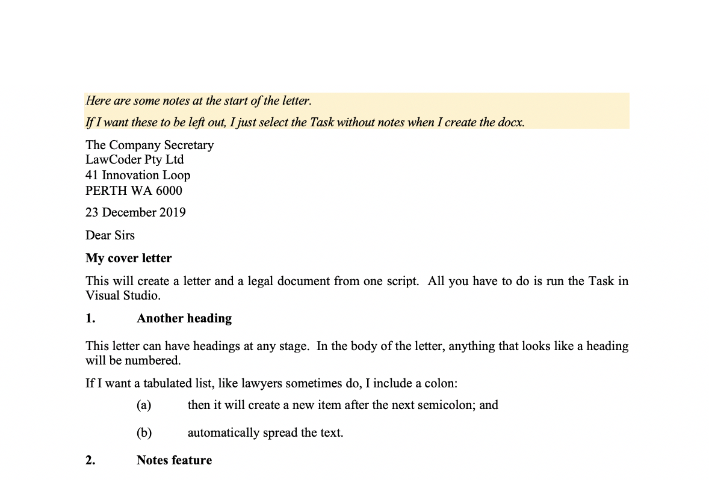
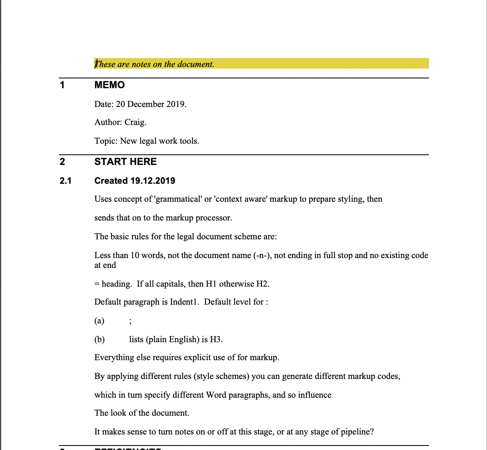

# How to run a PML parser to create docx using Visual Studio

Running the PML to docx process in Visual Studio is easy, once the task.json file is set up.

Load up your script file (now .pml; older versions have .lmd)

First select 'Run Task' under Terminal.

Then Select the installed task for notes, or for no notes.

Then if you have document division code `-n-` in the script like shown here:

You will end up with one .docx document like this in the output folder:

and the other like this:

